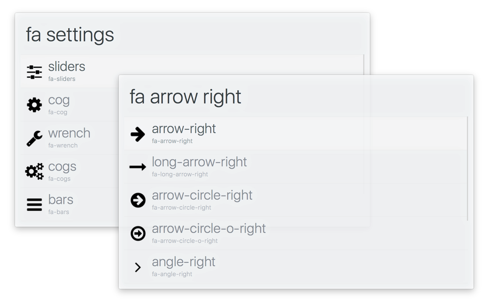

# alfred-font-awesome [](https://travis-ci.org/SamVerschueren/alfred-font-awesome)

> Alfred workflow to search for [font-awesome](http://fontawesome.io/) icons




## Install

```
$ npm install -g alfred-font-awesome
```

*Requires [Node.js](https://nodejs.org) 4+ and the Alfred [Powerpack](https://www.alfredapp.com/powerpack/).*


## Usage

In Alfred, type `fa`, <kbd>Enter</kbd>, and your search query.

Select an icon and press <kbd>Enter</kbd> to copy its css class name to the clipboard.<br>
Hold <kbd>Alt</kbd> when pressing <kbd>Enter</kbd> to copy its unicode value.


## Related

- [alfred-ng2](https://raw.githubusercontent.com/SamVerschueren/alfred-ng2) - Search for Angular 2 API references
- [alfred-npms](https://github.com/sindresorhus/alfred-npms) - Search for npm packages with npms.io
- [alfy](https://github.com/sindresorhus/alfy) - Create Alfred workflows with ease


## License

MIT © [Sam Verschueren](https://github.com/SamVerschueren)
